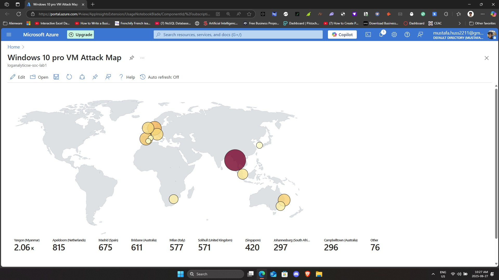
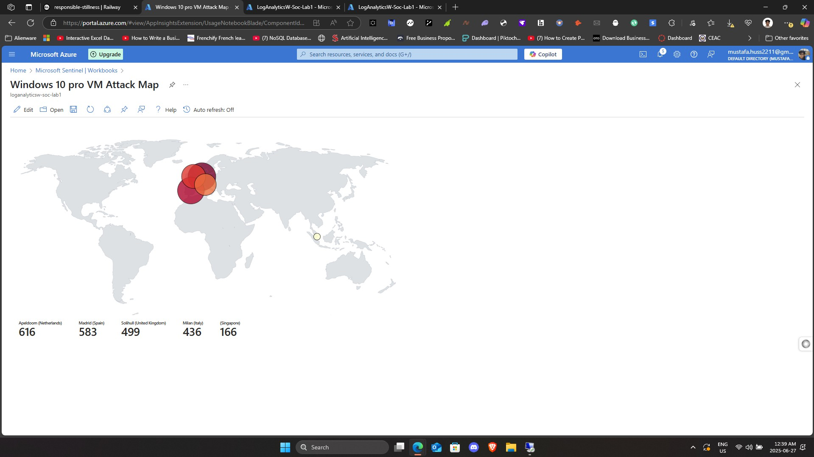
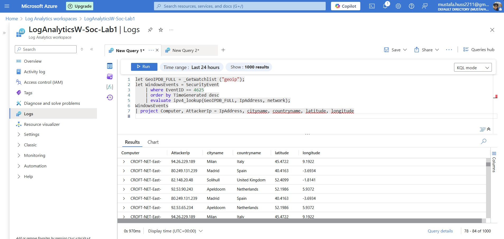

# Azure SOC Lab using Microsoft Sentinel

This project demonstrates how to set up a cloud-based SOC (Security Operations Center) using Microsoft Sentinel and a honeypot VM in Azure. The setup was designed to ingest real attack data, analyze failed login attempts, and enrich logs using GeoIP data through a custom watchlist.

---

## Overview

- Deployed a public-facing virtual machine in Azure
- Enabled log collection through Log Analytics Workspace
- Integrated Microsoft Sentinel for SIEM capabilities
- Captured Event ID 4625 (failed login attempts) from real attackers
- Enriched logs with GeoIP data using a custom watchlist
- Queried and visualized data using Kusto Query Language (KQL)

---

## Screenshots

### Attack Map – Minutes After Deployment  


### Attack Map – Next Day  


### GeoIP Enrichment Table  


---

## Detection Query

### GeoIP Enriched Failed Login Query

File: [`geoip_enriched_failed_logins.kql`](./queries/geoip_enriched_failed_logins.kql)

```kql
let GeoIPDB_FULL = _GetWatchlist("geoip");
let WindowsEvents = SecurityEvent
    | where EventID == 4625
    | order by TimeGenerated desc
    | evaluate ipv4_lookup(GeoIPDB_FULL, IpAddress, network);
WindowsEvents
| project Computer, AttackerIp = IpAddress, cityname, countryname, latitude, longitude
